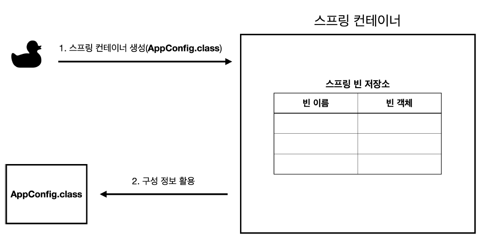

## 스프링 컨테이너란?

* 빈(bean)의 생명 주기(life cycle)와 의존성 주입(Dependency Injection)을 담당하는 컨테이너이다.
* 스프링 컨테이너가 관리하는 자바 객체를 `빈(bean)`이라고 한다. 

```
//스프링 컨테이너 생성
ApplicationContext applicationContext = new AnnotationConfigApplicationContext(AppConfig.class);
```

* 스프링 프로젝트에서 주로 인터페이스인 `ApplicationContext`가 스프링 컨테이너 역할을 한다.
* 스프링 컨테이너는 XML을 기반으로 만들 수 있고, 애노테이션 기반의 자바 설정 클래스로 만들 수 있다. 지금 예시에서는 `AppConfig`라는 애노테이션 기반의 자바 설정 클래스를 이용해 스프링 컨테이너를 만들었다.

<br>

## 스프링 컨테이너의 생성 과정

### 1. 스프링 컨테이너 생성



* 스프링 컨테이너를 생성할 때는 **구성 정보**를 지정해 주어야 한다.
* 여기서는 `AppConfig.class` 즉, 설정 클래스 정보를 구성 정보로 지정했다.

### 2. 스프링 빈 등록

* 스프링 컨테이너는 파라미터로 넘어온 설정 클래스 정보를 사용해서 스프링 빈을 등록한다.

#### 빈 이름 설정

* 빈 이름은 기본적으로 메서드 이름을 사용한다.
* 빈 이름을 직접 이용할 수도 있다.
  * `@Bean(name="memberService2")`
* **빈 이름은 항상 다른 이름을 부여**해야 한다. 같은 이름을 부여하면, 다른 빈이 무시되거나, 기존 빈을 덮어버리거나 설정에 따라 오류가 발생한다.

### 3. 스프링 의존관계 설정

* 스프링 컨테이너는 구성 정보를 참고해서 의존관계를 주입(DI)한다.

<br>

## 스프링 빈 조회 - 기본

* 스프링 컨테이너에서 스프링 빈을 찾는 가장 기본적인 조회 방법
 * `ac.getBean(빈이름, 타입)`
 * `ac.getBean(타입)`
 * 조회 대상 스프링 빈이 없으면 예외 발생
   * `NoSuchBeanDefinitionException: No bean named 'xxxxx' available`

## 스프링 빈 조회 - 동일한 타입이 둘 이상

* 타입으로 조회시 같은 타입의 스프링 빈이 둘 이상이면 오류가 발생한다. 이때, 빈 이름을 지정하면 된다.
* `ac.getBeansOfType()`을 사용하면 해당 타입의 모든 빈을 조회할 수 있다.

## 스프링 빈 조회 - 상속 관계

* 부모 타입으로 조회하면, 자식 타입도 함께 조회한다.
* 그래서 모든 자바 객체의 최고 부모인 `Object` 타입으로 조회하면, 모든 스프링 빈을 조회한다.
