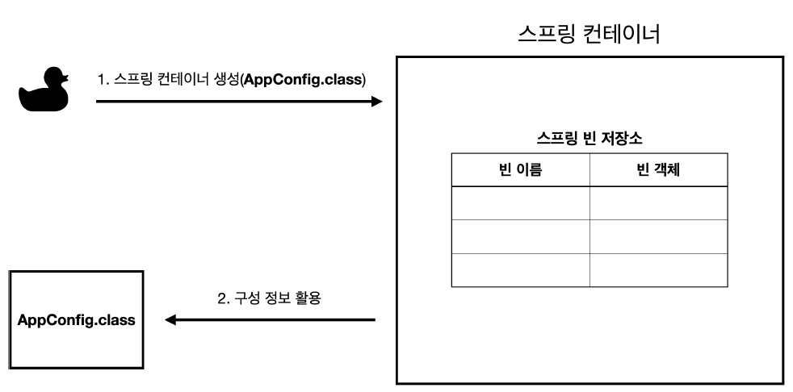

## 스프링 컨테이너란?

* 빈(bean)의 생명 주기(life cycle)와 의존성 주입(Dependency Injection)을 담당하는 컨테이너이다.
* 스프링 컨테이너가 관리하는 자바 객체를 `빈(bean)`이라고 한다. 

```
//스프링 컨테이너 생성
ApplicationContext applicationContext = new AnnotationConfigApplicationContext(AppConfig.class);
```

* 스프링 프로젝트에서 주로 인터페이스인 `ApplicationContext`가 스프링 컨테이너 역할을 한다.
* 스프링 컨테이너는 XML을 기반으로 만들 수 있고, 애노테이션 기반의 자바 설정 클래스로 만들 수 있다. 지금 예시에서는 `AppConfig`라는 애노테이션 기반의 자바 설정 클래스를 이용해 스프링 컨테이너를 만들었다.

<br>

## 스프링 컨테이너의 생성 과정

### 1. 스프링 컨테이너 생성



* 스프링 컨테이너를 생성할 때는 **구성 정보**를 지정해 주어야 한다.
* 여기서는 `AppConfig.class` 즉, 설정 클래스 정보를 구성 정보로 지정했다.

### 2. 스프링 빈 등록

* 스프링 컨테이너는 파라미터로 넘어온 설정 클래스 정보를 사용해서 스프링 빈을 등록한다.

#### 빈 이름 설정

* 빈 이름은 기본적으로 메서드 이름을 사용한다.
* 빈 이름을 직접 이용할 수도 있다.
  * `@Bean(name="memberService2")`
* **빈 이름은 항상 다른 이름을 부여**해야 한다. 같은 이름을 부여하면, 다른 빈이 무시되거나, 기존 빈을 덮어버리거나 설정에 따라 오류가 발생한다.

### 3. 스프링 의존관계 설정

* 스프링 컨테이너는 구성 정보를 참고해서 의존관계를 주입(DI)한다.

<br>

## 스프링 빈 조회 - 기본

* 스프링 컨테이너에서 스프링 빈을 찾는 가장 기본적인 조회 방법
 * `ac.getBean(빈이름, 타입)`
 * `ac.getBean(타입)`
 * 조회 대상 스프링 빈이 없으면 예외 발생
   * `NoSuchBeanDefinitionException: No bean named 'xxxxx' available`

## 스프링 빈 조회 - 동일한 타입이 둘 이상

* 타입으로 조회시 같은 타입의 스프링 빈이 둘 이상이면 오류가 발생한다. 이때, 빈 이름을 지정하면 된다.
* `ac.getBeansOfType()`을 사용하면 해당 타입의 모든 빈을 조회할 수 있다.

## 스프링 빈 조회 - 상속 관계

* 부모 타입으로 조회하면, 자식 타입도 함께 조회한다.
* 그래서 모든 자바 객체의 최고 부모인 `Object` 타입으로 조회하면, 모든 스프링 빈을 조회한다.

<br>

## BeanFactory와 ApplicationContext

* **BeanFactory**
  * 스프링 컨테이너의 최상위 인터페이스다.
  * 스프링 빈을 관리하고 조회하는 역할을 담당한다.
  * `getBean()` 을 제공한다.
  * 지금까지 우리가 사용했던 대부분의 기능은 BeanFactory가 제공하는 기능이다.

* **ApplicationContext**
  * BeanFactory 기능을 모두 상속받아서 제공한다.
  * 메시지소스를 활용한 국제화 기능, 환경변수, 애플리케이션 이벤트, 편리한 리소스 조회 등 수 많은 부가기능을 제공한다. 

<br>

## 다양한 설정 형식 지원 - 자바 코드, XML

* 스프링 컨테이너는 다양한 형식의 설정 정보를 받아들일 수 있게 유연하게 설계되어 있다.
  * 자바 코드, XML, Groovy 등등

### 애노테이션 기반 자바 코드 설정 사용

* `new AnnotationConfigApplicationContext(AppConfig.class)`
* `AnnotationConfigApplicationContext` 클래스를 사용하면서 자바 코드로 된 설정 정보를 넘기면 된다.

### XML 설정 사용

* `GenericXmlApplicationContext` 클래스를 사용하면서 `xml` 설정 파일을 넘기면 된다.

<br>

## 스프링 빈 설정 메타 정보 - BeanDefinition

* 스프링은 어떻게 이런 다양한 설정 형식을 지원하는 것일까? 그 중심에는 `BeanDefinition` 이라는 추상화가 있다.
*  `BeanDefinition`은 설정 정보를 추상화하여 **역할과 구현을 개념적으로 나누는 것**에 도움을 준다.
   * XML을 읽어서 `BeanDefinition`을 만든다.
   * 자바 코드를 읽어서 `BeanDefinition`을 만든다.
   * 스프링 컨테이너는 자바 코드인지, XML인지 몰라도 된다. 오직 BeanDefinition만 알면 된다.
* `BeanDefinition` 을 빈 설정 메타정보라 한다.
   * `@Bean` , `<bean>` 당 각각 하나씩 메타 정보가 생성된다.
* 스프링 컨테이너는 이 메타정보를 기반으로 스프링 빈을 생성한다.

## BeanDefinition 살펴보기

### BeanDefinition 정보

* BeanClassName: 생성할 빈의 클래스 명(자바 설정처럼 팩토리 역할의 빈을 사용하면 없음)
* factoryBeanName: 팩토리 역할의 빈을 사용할 경우 이름, 예) appConfig
* factoryMethodName: 빈을 생성할 팩토리 메서드 지정, 예) memberService
* Scope: 싱글톤(기본값)
* lazyInit: 스프링 컨테이너를 생성할 때 빈을 생성하는 것이 아니라, 실제 빈을 사용할 때 까지 최대한 생성을 지연처리 하는지 여부
* InitMethodName: 빈을 생성하고, 의존관계를 적용한 뒤에 호출되는 초기화 메서드 명
* DestroyMethodName: 빈의 생명주기가 끝나서 제거하기 직전에 호출되는 메서드 명
